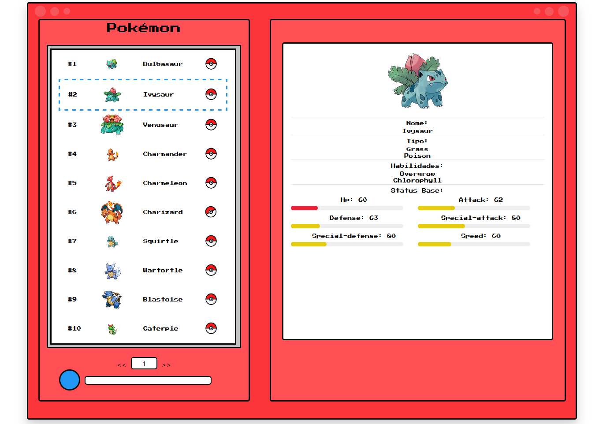

# Pokedex in React

The project create is a pokedex, made with the objective of learning React, the end result can be seen below:

### About the Program
You can search by all the PokeAPI results, which are presented in 112 different pages, or search for an specific pokemon name.
By clicking in the pokeball, it's possible to see more detailed information about the pokemon.
